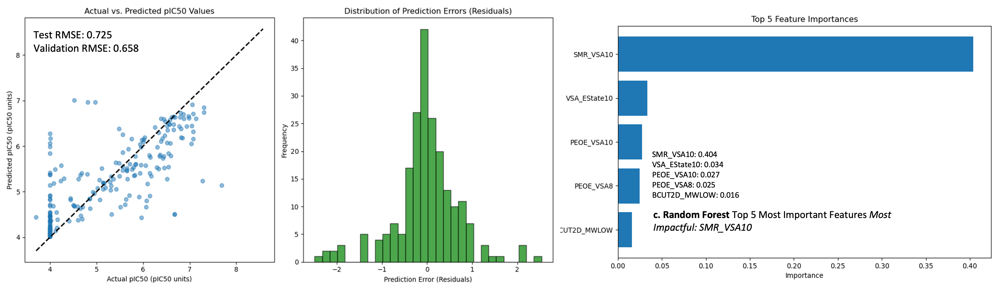
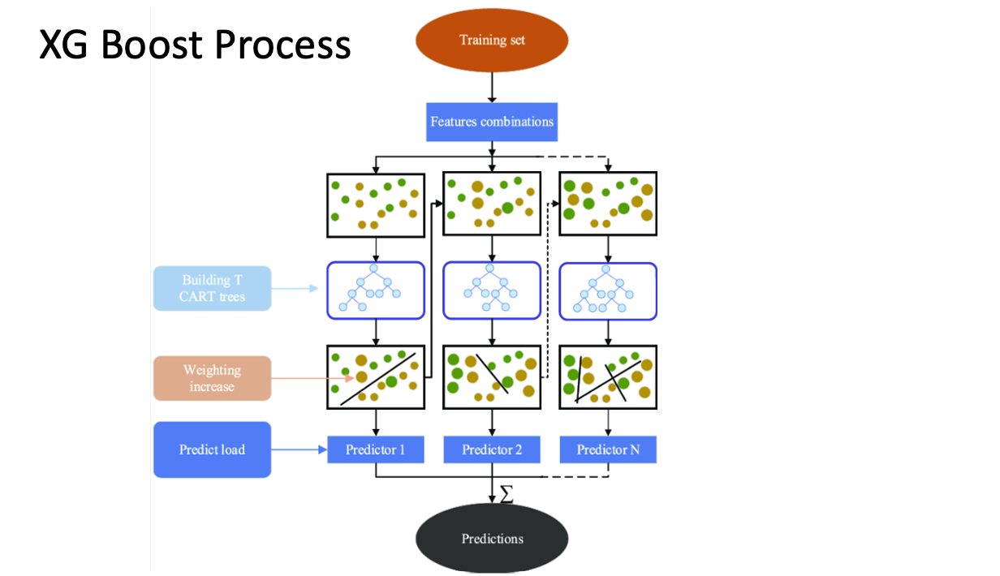

## Introduction

- We utilise data from [PostEra's COVID Moonshot project](https://postera.ai/moonshot/) to develop statistical machine-learning models for virtual screening of ligands that will inhibit [SARS-CoV-2 main protease (Mpro)](https://www.nature.com/articles/s41586-020-2223-y), a viral enzyme essential to viral maturation.

- In doing so, we set out to experiment with a variety of machine learning methods to identify the approach that yielded the best performance for the data. 

### Cleaning the Data 

- We set up a relational database to store data from the MOONSHOT project.

- We calculated pIC50 values using f_avg_IC50 (collected from Fluorescence Assay) and r_avg_IC50 (Rapidfire Assay). 

- We ran predictions for each in tandem instead of taking an average.

- We first limited our data to compounds which satisfied [Lipinski’s Rule of 5](https://en.wikipedia.org/wiki/Lipinski%27s_rule_of_five)

## [Random Forest](https://arxiv.org/abs/1407.7502)

- A collection of Decision Trees, each trained on a random subset of the training data.

- Each tree gives a prediction, and the final output of the Random Forest is determined by combining these predictions. 

- In classification tasks, this is typically done by a "majority vote" method, and for regression, it's usually the average of the predictions.

### Random Forest Method and Results

- Each forest out of 100 was trained on different molecules' molecular descriptors, where one tree may have been more influenced by molecular weight and polarisability. 

- At the same time, another might be more influenced by the presence of specific functional groups and ring sizes to predict pIC50.

- When a new molecule and its molecular descriptors are inputted into the forest, each tree predicts what the pIC50 will be for that molecule. 

- As pIC50 is continuous, therefore, regression-based, an average of the pIC50 is taken, and the final pIC50 is given. 

- We plotted an actual pic50 against the predicted and got a **test rmse of 0.725 and validation rmse of 0.658**

## [XGBoost](https://arxiv.org/abs/1603.02754)

- An Ensemble learning method – combines predictions of decision trees.

- XG Boost uses boosting - weak models are trained sequentially, with each model trying to correct the mistakes made by the last. 

- The final prediction is a weighted sum of the individual weak model predictions.

### XGBoost Results

- **Predicted v Actual pIC50**: Test Mean Squared Error: 0.551, Validation RMSE: 0.577

- **Distribution of Residuals**: Residuals seemingly normalised about mean 0. This seems to be more normalised than Random Forest. 

- **Top 5 Most Important Features** Most Impactful: SMR_VSA10. Same top feature as Random Forest, but otherwise, a different ranking list

Go into Src

- Before starting, unzip the assay_database file and make sure the name is actually 'assay_database.db'. 

- Run database.py

- This gives the assay_database.db database. (which can be visualused on SQLite)

- Run calculate_pic50.py to give pic50s (which is inseretd as a new table in assay_database)

- Run lipinski_XGBR.py or lipinski_RandomF.py or lipinski_SVMs.py to get models that predcit pIC50 values based on lipinski RO5

- This gives Test RMSE and Validation RMSE alongside other analysis.

- Run calculate_ECFP_Strings.py to get ECFP fingerprints (this is stored in the assay_database.py)

- Run ECFP_Model_XGBR.py or ECFP_Model_RandomF.py or ECFP_Model_SVMs.py to get models that predict pIC50 values based on ECFP fingerprints

- To get model that predicts pIC50 based on 200+ molecular properties (not just lipinski rule) go into new_analysis.

- Before starting, unzip the assay_database file and make sure the name is actually 'assay_database.db'.

- Run rdkit_computations.py

- This computes the descriptors based on the SMILES strings in the database and stores it as new table with 200+ columns (descriptors)

- Run descriptors_XGBR.py or descriptors_RF.py or descriptors_SVMs.py to get models that predict pIC50 values based on descriptors fingerprints.
